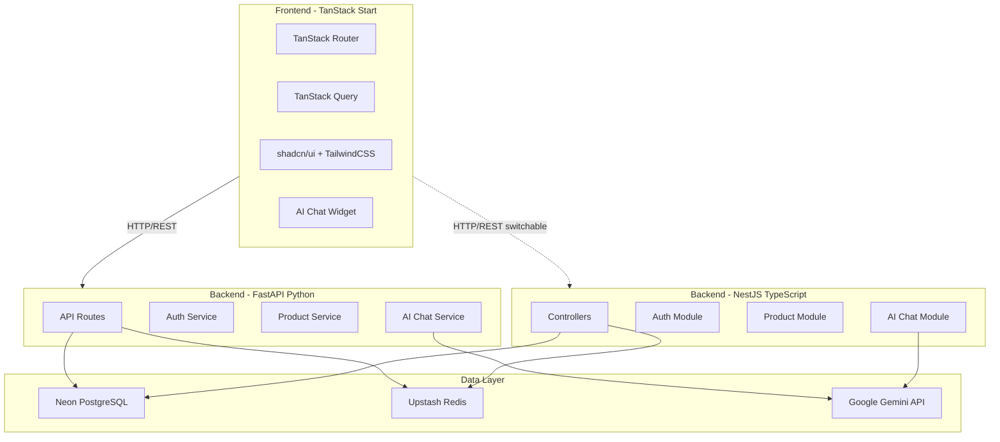
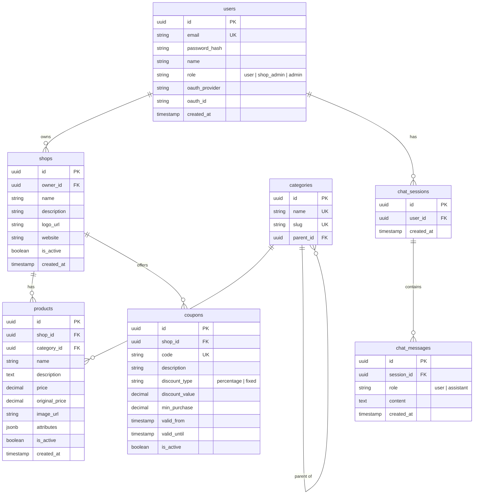

# AI Commercial Platform

> **Learning Project Note**: This project serves as a hands-on learning environment for a **senior Next.js/React developer learning backend development**. Both backends are learning exercises:
>
> - **FastAPI (Python)** — Learn Python, async programming, SQLAlchemy ORM, and how a non-JS backend works
> - **NestJS (TypeScript)** — Learn backend architecture patterns (DI, modules, guards) in a familiar TypeScript environment
>
> Each feature includes explanations comparing backend patterns to familiar Next.js/React concepts (e.g., NestJS modules ≈ Next.js route groups, FastAPI dependencies ≈ React context, decorators ≈ higher-order components). Code comments and docs explain the *why* behind backend patterns like dependency injection, guards/middleware, interceptors, and ORM relationships.

## Overview

Build a full-stack commercial platform with an AI chatbot (Google Gemini) that helps users find products, compare products/shops, and discover coupons/sales. Frontend uses TanStack Start + shadcn/ui. Two backend implementations exist for learning purposes:

1. **FastAPI (Python)** — Learning Python & async backend patterns, implemented through Phase 4
2. **NestJS (TypeScript)** — Learning backend architecture (DI, modules, guards) in TypeScript, mirrors the same API contract so the frontend can switch between them

Both backends connect to the same **Neon PostgreSQL** database and **Upstash Redis** cache.

## Progress

### FastAPI Backend (Original)

- [x] Phase 1: Project scaffolding
- [x] Phase 2: Database models & migrations
- [x] Phase 3: Auth system
- [x] Phase 4: Core CRUD APIs & pages
- [ ] Phase 5: Admin dashboard
- [ ] Phase 6: AI Chatbot
- [ ] Phase 7: Product comparison
- [ ] Phase 8: Polish & production readiness

### NestJS Backend (Learning)

- [x] Phase 1: Project scaffolding & configuration
- [x] Phase 2: Database entities & DTOs
- [x] Phase 3: Auth system
- [x] Phase 4: Core CRUD APIs

## Architecture Overview



### NestJS vs Next.js — Mental Model for React Devs

| NestJS Concept | Next.js/React Equivalent | What It Does |
|---|---|---|
| **Module** (`@Module`) | Route group / layout boundary | Organizes related features; controls what's available where |
| **Controller** (`@Controller`) | API route handler (`app/api/...`) | Handles HTTP requests, defines endpoints |
| **Service** (`@Injectable`) | Server action / utility function | Business logic, reusable across controllers |
| **DTO** (Data Transfer Object) | Zod schema / TypeScript interface | Validates & shapes request/response data |
| **Entity** (TypeORM) | Prisma/Drizzle model | Maps to a database table |
| **Guard** (`@UseGuards`) | Middleware / `withAuth` HOC | Protects routes (auth checks) |
| **Interceptor** | React `Suspense` / error boundary | Wraps request/response (transform, cache, log) |
| **Pipe** | Zod `.parse()` in server action | Validates/transforms input before handler |
| **Decorator** | HOC / custom hook | Adds metadata or behavior declaratively |
| **Dependency Injection** | React Context + `useContext` | Provides instances to classes that need them |

## Project Structure

```
ai-commercial/
├── frontend/                    # TanStack Start app
│   ├── src/
│   │   ├── routes/
│   │   │   ├── __root.tsx       # Root layout
│   │   │   ├── index.tsx        # Home/landing page
│   │   │   ├── products/        # Product listing & detail
│   │   │   ├── shops/           # Shop listing & detail
│   │   │   ├── deals/           # Coupons & sales page
│   │   │   ├── compare/         # Product comparison page
│   │   │   ├── auth/            # Login, register, OAuth callback
│   │   │   └── admin/           # Admin dashboard
│   │   ├── components/
│   │   │   ├── ui/              # shadcn components
│   │   │   ├── chat/            # AI chatbot widget
│   │   │   ├── product/         # Product card, grid, detail
│   │   │   ├── layout/          # Header, footer, sidebar
│   │   │   └── admin/           # Admin-specific components
│   │   ├── lib/
│   │   │   ├── api.ts           # API client (fetch wrapper)
│   │   │   ├── auth.ts          # Auth utilities
│   │   │   └── utils.ts         # General utilities
│   │   └── styles.css           # TailwindCSS v4 styles
│   ├── components.json          # shadcn/ui config
│   ├── vite.config.ts           # Vite + TanStack Start config
│   └── package.json
│
├── backend/                     # FastAPI app
│   ├── app/
│   │   ├── main.py              # FastAPI app entry
│   │   ├── api/
│   │   │   ├── auth.py          # Auth endpoints
│   │   │   ├── products.py      # Product CRUD + search
│   │   │   ├── shops.py         # Shop CRUD
│   │   │   ├── coupons.py       # Coupon/sales endpoints
│   │   │   ├── compare.py       # Comparison endpoints
│   │   │   └── chat.py          # AI chat endpoint (SSE)
│   │   ├── models/              # SQLAlchemy ORM models
│   │   ├── schemas/             # Pydantic request/response schemas
│   │   ├── services/
│   │   │   ├── auth_service.py  # Auth logic, JWT, OAuth
│   │   │   ├── product_service.py
│   │   │   ├── coupon_service.py
│   │   │   └── ai_service.py    # Gemini integration + tools
│   │   ├── core/
│   │   │   ├── config.py        # Settings (env vars)
│   │   │   ├── database.py      # Neon/async SQLAlchemy
│   │   │   ├── redis.py         # Upstash Redis client
│   │   │   └── security.py      # Password hashing, JWT
│   │   └── migrations/          # Alembic migrations
│   ├── requirements.txt
│   └── alembic.ini
│
├── backend-nest/                   # NestJS app (learning backend)
│   ├── src/
│   │   ├── main.ts                 # Bootstrap (like Next.js server.ts)
│   │   ├── app.module.ts           # Root module (like _app.tsx / layout.tsx)
│   │   ├── config/                 # Configuration module
│   │   │   └── config.module.ts    # Env vars via @nestjs/config (like next.config.ts)
│   │   ├── database/               # Database setup
│   │   │   └── database.module.ts  # TypeORM connection (like prisma client)
│   │   ├── redis/                  # Redis module
│   │   │   └── redis.module.ts     # Upstash Redis client
│   │   ├── auth/                   # Auth module
│   │   │   ├── auth.module.ts
│   │   │   ├── auth.controller.ts  # POST /auth/login, /auth/register (like app/api/auth)
│   │   │   ├── auth.service.ts     # Business logic
│   │   │   ├── strategies/         # Passport strategies (JWT, Google OAuth)
│   │   │   ├── guards/             # Auth guards (like middleware.ts)
│   │   │   └── dto/                # Validation DTOs (like Zod schemas)
│   │   ├── users/                  # Users module
│   │   ├── products/               # Products module
│   │   │   ├── products.module.ts
│   │   │   ├── products.controller.ts
│   │   │   ├── products.service.ts
│   │   │   ├── entities/           # TypeORM entities (like Prisma models)
│   │   │   └── dto/
│   │   ├── shops/                  # Shops module
│   │   ├── categories/             # Categories module
│   │   ├── coupons/                # Coupons module
│   │   └── common/                 # Shared utilities
│   │       ├── decorators/         # Custom decorators
│   │       ├── guards/             # Shared guards
│   │       ├── interceptors/       # Transform/logging interceptors
│   │       └── dto/                # Shared DTOs (pagination, etc.)
│   ├── test/
│   ├── package.json
│   ├── tsconfig.json
│   ├── tsconfig.build.json
│   └── nest-cli.json
│
├── .env.example                 # Environment variables template
├── .gitignore
└── PLAN.md
```

## Database Schema (Neon PostgreSQL)



## AI Chatbot Design

The chatbot uses **Google Gemini** with **function calling** (tool use) to interact with the database through predefined tools:

- **search_products(query, category, price_range)** - Search products by natural language
- **compare_products(product_ids)** - Compare 2+ products side by side
- **find_coupons(shop_name, category)** - Find active coupons/deals
- **get_shop_info(shop_name)** - Get shop details and their products
- **get_product_details(product_id)** - Get full product info

The AI will receive the tool results and formulate natural-language responses with product cards/links embedded via structured output.

## Auth Flow

- **Email/Password**: Register with email + password, bcrypt hashing, JWT access + refresh tokens stored in httpOnly cookies
- **OAuth (Google)**: Redirect flow via Google OAuth2, create/link user on callback
- **Sessions**: JWT tokens with Upstash Redis for token blacklisting (logout) and rate limiting

## Implementation Phases

### Phase 1: Project Scaffolding (DONE)

- Initialize TanStack Start frontend project with TailwindCSS and shadcn/ui
- Initialize FastAPI backend with project structure
- Set up Neon database connection and Alembic migrations
- Set up Upstash Redis connection
- Create `.env.example` with all required env vars

**FastAPI learning notes**:
- `FastAPI()` = the app instance (like `createApp()` in Express or `next()` in custom Next.js server)
- `uvicorn` = ASGI server that runs your app (like `next start` running the Node server)
- Python `async/await` = same concept as JS, but Python uses `asyncio` event loop under the hood
- `@app.on_event("startup")` / lifespan = setup code that runs once when server starts (like top-level `await` in a server module)

### Phase 2: Database Models & Migrations (DONE)

- Define SQLAlchemy models (users, shops, categories, products, coupons, chat_sessions, chat_messages)
- Create Pydantic request/response schemas for all entities
- Create Alembic migration scripts
- Seed script with sample data for development

**FastAPI learning notes**:
- `SQLAlchemy` ORM = like Prisma/Drizzle but for Python; models are classes with column definitions
- `Alembic` = migration tool (like `prisma migrate` or `drizzle-kit push`)
- `Pydantic` schemas = like Zod schemas; validates request/response data with type hints
- Python type hints (`str`, `int`, `Optional[str]`) = like TypeScript types but checked at runtime by Pydantic

### Phase 3: Auth System (DONE)

- Backend: JWT auth with password hashing, login/register endpoints, Google OAuth flow
- Backend: Redis-backed session management (token blacklisting) and rate limiting middleware
- Frontend: API client with auto-refresh, auth hooks (useAuth, useLogin, useRegister, useLogout)
- Frontend: Auth pages (login, register, Google OAuth callback), UserMenu component

**FastAPI learning notes**:
- `Depends()` = dependency injection (like React Context — provide once, use everywhere)
- `OAuth2PasswordBearer` = extracts JWT from request (like reading a cookie in `middleware.ts`)
- `passlib` / `bcrypt` = password hashing library (same concept as `bcryptjs` in Node)
- Python decorators (`@router.post`) = like TypeScript decorators or HOCs — wrap a function with extra behavior

### Phase 4: Core CRUD APIs & Pages (DONE)

- Backend: Product, Shop, Coupon, Category CRUD APIs with filtering/pagination
- Backend: Ownership authorization, pagination envelope, eager loading
- Frontend: Shared types, query hooks, API client integration
- Frontend: Product listing page with filters (category, price, shop, on_sale, search)
- Frontend: Product detail page with breadcrumbs and specs
- Frontend: Shop listing and detail pages (with inline coupons and products)
- Frontend: Deals/coupons page (active coupons + on-sale products)
- Frontend: Updated Header navigation (Products, Shops, Deals)

**FastAPI learning notes**:
- `@router.get("/products")` = route handler (like `export function GET()` in Next.js API routes)
- `Query(None)` = optional query parameter with default (like `searchParams.get("q")`)
- SQLAlchemy `select().where().options(joinedload())` = query building with eager loading (like Prisma `findMany({ where, include })`)
- `HTTPException(status_code=403)` = throwing HTTP errors (like `NextResponse.json({}, { status: 403 })`)

### Phase 5: Admin Dashboard

- Backend: Admin-only endpoints for managing shops, products, coupons
- Frontend: Admin layout with sidebar navigation
- Frontend: CRUD forms for products, coupons, shop settings

### Phase 6: AI Chatbot

- Backend: Gemini integration with function-calling tools
- Backend: SSE streaming endpoint for chat responses
- Backend: Chat history persistence
- Frontend: Floating chat widget with message streaming
- Frontend: Rich message rendering (product cards, comparison tables, coupon badges)

### Phase 7: Product Comparison

- Backend: Comparison endpoint that returns normalized product attributes
- Frontend: Comparison page with side-by-side view
- Integration with chatbot (AI can suggest comparisons)

### Phase 8: Polish & Production Readiness

- Search optimization (PostgreSQL full-text search via `tsvector`)
- Redis caching for hot product/coupon queries
- Error handling, loading states, toast notifications
- Responsive design pass
- Environment-based configuration for deployment

---

## NestJS Backend — Implementation Phases

> Each phase explains backend concepts in terms you already know from Next.js/React.

### NestJS Phase 1: Project Scaffolding & Configuration

**What you'll learn**: How NestJS bootstraps (vs `next start`), module system, config management, database & cache connections.

- Initialize NestJS project with `@nestjs/cli`
- Set up `ConfigModule` for environment variables (similar to `next.config.ts` env)
- Set up `TypeORM` with Neon PostgreSQL (similar to Prisma/Drizzle setup)
- Set up `ioredis` with Upstash Redis
- CORS configuration (like `next.config.ts` headers)

**Key concepts**:
- `main.ts` = the server entry point (like `server.ts` in a custom Next.js server)
- `AppModule` = root module that imports all feature modules (like `_app.tsx` or root `layout.tsx`)
- `@Module({ imports, controllers, providers })` = declares what a module needs, exposes, and provides

### NestJS Phase 2: Database Entities & Migrations

**What you'll learn**: TypeORM entities (like Prisma models), decorators for columns/relations, migrations.

- Define TypeORM entities for all tables (users, shops, categories, products, coupons, chat)
- Create DTOs with `class-validator` decorators (like Zod schemas but using decorators)
- Set up TypeORM migrations (like `prisma migrate`)
- Create seed script

**Key concepts**:
- `@Entity()` = declares a class maps to a DB table (like `model User` in Prisma)
- `@Column()`, `@PrimaryGeneratedColumn('uuid')` = define table columns
- `@ManyToOne()`, `@OneToMany()` = relationships (like Prisma `@relation`)
- DTOs with `@IsString()`, `@IsEmail()` = runtime validation (Zod `.string()`, `.email()` equivalent)

### NestJS Phase 3: Auth System

**What you'll learn**: Passport.js integration, JWT strategy, guards (like Next.js middleware), bcrypt hashing.

- JWT authentication with `@nestjs/passport` + `passport-jwt`
- Password hashing with bcrypt
- Login/register endpoints in `AuthController`
- Google OAuth2 strategy with `passport-google-oauth20`
- Auth guard (`@UseGuards(JwtAuthGuard)`) — like `middleware.ts` protecting routes
- Redis-backed token blacklisting for logout
- Rate limiting with `@nestjs/throttler`

**Key concepts**:
- `Strategy` = a Passport pattern that extracts & validates credentials (JWT from cookie, OAuth token, etc.)
- `Guard` = runs before the controller method, decides allow/deny (like Next.js `middleware.ts`)
- `@UseGuards(JwtAuthGuard)` = decorator that protects an endpoint (like `withAuth()` HOC)
- `@CurrentUser()` = custom decorator to get the logged-in user (like a `useUser()` hook but server-side)

### NestJS Phase 4: Core CRUD APIs

**What you'll learn**: Controllers with route decorators, services with repository pattern, query builders, pagination.

- Product CRUD with filtering (category, price range, shop, search, on_sale) & pagination
- Shop CRUD with ownership checks
- Coupon CRUD with active/expired filtering
- Category CRUD with parent-child tree
- Pagination envelope response format (matching FastAPI's format for frontend compatibility)
- Ownership authorization via guards

**Key concepts**:
- `@Controller('products')` = defines route prefix (like `app/api/products/route.ts`)
- `@Get()`, `@Post()`, `@Patch()`, `@Delete()` = HTTP method decorators (like `export function GET/POST`)
- `@Query()`, `@Param()`, `@Body()` = extract parts of the request (like `searchParams`, `params`, `request.json()`)
- `Repository` pattern = data access layer (like Prisma client queries in a server action)
- `QueryBuilder` = complex queries with joins/filters (like Prisma's `where` + `include`)
