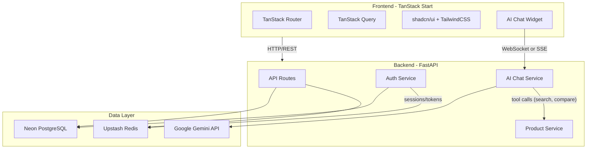
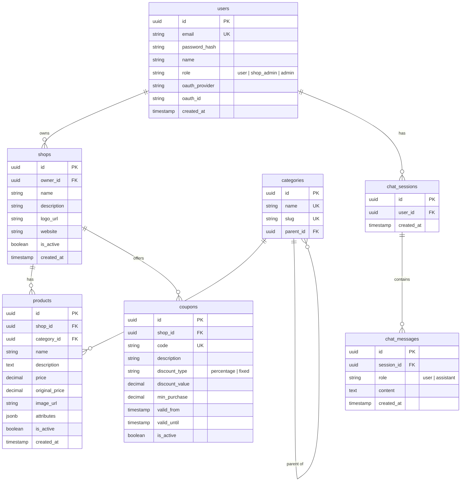

# AI Commercial Platform

## Overview

Build a full-stack commercial platform with an AI chatbot (Google Gemini) that helps users find products, compare products/shops, and discover coupons/sales. Frontend uses TanStack Start + shadcn/ui, backend uses FastAPI + Neon PostgreSQL + Upstash Redis.

## Progress

- [x] Phase 1: Project scaffolding
- [x] Phase 2: Database models & migrations
- [x] Phase 3: Auth system
- [x] Phase 4: Core CRUD APIs & pages
- [ ] Phase 5: Admin dashboard
- [ ] Phase 6: AI Chatbot
- [ ] Phase 7: Product comparison
- [ ] Phase 8: Polish & production readiness

## Architecture Overview



## Project Structure

```
ai-commercial/
├── frontend/                    # TanStack Start app
│   ├── src/
│   │   ├── routes/
│   │   │   ├── __root.tsx       # Root layout
│   │   │   ├── index.tsx        # Home/landing page
│   │   │   ├── products/        # Product listing & detail
│   │   │   ├── shops/           # Shop listing & detail
│   │   │   ├── deals/           # Coupons & sales page
│   │   │   ├── compare/         # Product comparison page
│   │   │   ├── auth/            # Login, register, OAuth callback
│   │   │   └── admin/           # Admin dashboard
│   │   ├── components/
│   │   │   ├── ui/              # shadcn components
│   │   │   ├── chat/            # AI chatbot widget
│   │   │   ├── product/         # Product card, grid, detail
│   │   │   ├── layout/          # Header, footer, sidebar
│   │   │   └── admin/           # Admin-specific components
│   │   ├── lib/
│   │   │   ├── api.ts           # API client (fetch wrapper)
│   │   │   ├── auth.ts          # Auth utilities
│   │   │   └── utils.ts         # General utilities
│   │   └── styles.css           # TailwindCSS v4 styles
│   ├── components.json          # shadcn/ui config
│   ├── vite.config.ts           # Vite + TanStack Start config
│   └── package.json
│
├── backend/                     # FastAPI app
│   ├── app/
│   │   ├── main.py              # FastAPI app entry
│   │   ├── api/
│   │   │   ├── auth.py          # Auth endpoints
│   │   │   ├── products.py      # Product CRUD + search
│   │   │   ├── shops.py         # Shop CRUD
│   │   │   ├── coupons.py       # Coupon/sales endpoints
│   │   │   ├── compare.py       # Comparison endpoints
│   │   │   └── chat.py          # AI chat endpoint (SSE)
│   │   ├── models/              # SQLAlchemy ORM models
│   │   ├── schemas/             # Pydantic request/response schemas
│   │   ├── services/
│   │   │   ├── auth_service.py  # Auth logic, JWT, OAuth
│   │   │   ├── product_service.py
│   │   │   ├── coupon_service.py
│   │   │   └── ai_service.py    # Gemini integration + tools
│   │   ├── core/
│   │   │   ├── config.py        # Settings (env vars)
│   │   │   ├── database.py      # Neon/async SQLAlchemy
│   │   │   ├── redis.py         # Upstash Redis client
│   │   │   └── security.py      # Password hashing, JWT
│   │   └── migrations/          # Alembic migrations
│   ├── requirements.txt
│   └── alembic.ini
│
├── .env.example                 # Environment variables template
├── .gitignore
└── PLAN.md
```

## Database Schema (Neon PostgreSQL)



## AI Chatbot Design

The chatbot uses **Google Gemini** with **function calling** (tool use) to interact with the database through predefined tools:

- **search_products(query, category, price_range)** - Search products by natural language
- **compare_products(product_ids)** - Compare 2+ products side by side
- **find_coupons(shop_name, category)** - Find active coupons/deals
- **get_shop_info(shop_name)** - Get shop details and their products
- **get_product_details(product_id)** - Get full product info

The AI will receive the tool results and formulate natural-language responses with product cards/links embedded via structured output.

## Auth Flow

- **Email/Password**: Register with email + password, bcrypt hashing, JWT access + refresh tokens stored in httpOnly cookies
- **OAuth (Google)**: Redirect flow via Google OAuth2, create/link user on callback
- **Sessions**: JWT tokens with Upstash Redis for token blacklisting (logout) and rate limiting

## Implementation Phases

### Phase 1: Project Scaffolding (DONE)

- Initialize TanStack Start frontend project with TailwindCSS and shadcn/ui
- Initialize FastAPI backend with project structure
- Set up Neon database connection and Alembic migrations
- Set up Upstash Redis connection
- Create `.env.example` with all required env vars

### Phase 2: Database Models & Migrations (DONE)

- Define SQLAlchemy models (users, shops, categories, products, coupons, chat_sessions, chat_messages)
- Create Pydantic request/response schemas for all entities
- Create Alembic migration scripts
- Seed script with sample data for development

### Phase 3: Auth System (DONE)

- Backend: JWT auth with password hashing, login/register endpoints, Google OAuth flow
- Backend: Redis-backed session management (token blacklisting) and rate limiting middleware
- Frontend: API client with auto-refresh, auth hooks (useAuth, useLogin, useRegister, useLogout)
- Frontend: Auth pages (login, register, Google OAuth callback), UserMenu component

### Phase 4: Core CRUD APIs & Pages (DONE)

- Backend: Product, Shop, Coupon, Category CRUD APIs with filtering/pagination
- Backend: Ownership authorization, pagination envelope, eager loading
- Frontend: Shared types, query hooks, API client integration
- Frontend: Product listing page with filters (category, price, shop, on_sale, search)
- Frontend: Product detail page with breadcrumbs and specs
- Frontend: Shop listing and detail pages (with inline coupons and products)
- Frontend: Deals/coupons page (active coupons + on-sale products)
- Frontend: Updated Header navigation (Products, Shops, Deals)

### Phase 5: Admin Dashboard

- Backend: Admin-only endpoints for managing shops, products, coupons
- Frontend: Admin layout with sidebar navigation
- Frontend: CRUD forms for products, coupons, shop settings

### Phase 6: AI Chatbot

- Backend: Gemini integration with function-calling tools
- Backend: SSE streaming endpoint for chat responses
- Backend: Chat history persistence
- Frontend: Floating chat widget with message streaming
- Frontend: Rich message rendering (product cards, comparison tables, coupon badges)

### Phase 7: Product Comparison

- Backend: Comparison endpoint that returns normalized product attributes
- Frontend: Comparison page with side-by-side view
- Integration with chatbot (AI can suggest comparisons)

### Phase 8: Polish & Production Readiness

- Search optimization (PostgreSQL full-text search via `tsvector`)
- Redis caching for hot product/coupon queries
- Error handling, loading states, toast notifications
- Responsive design pass
- Environment-based configuration for deployment
